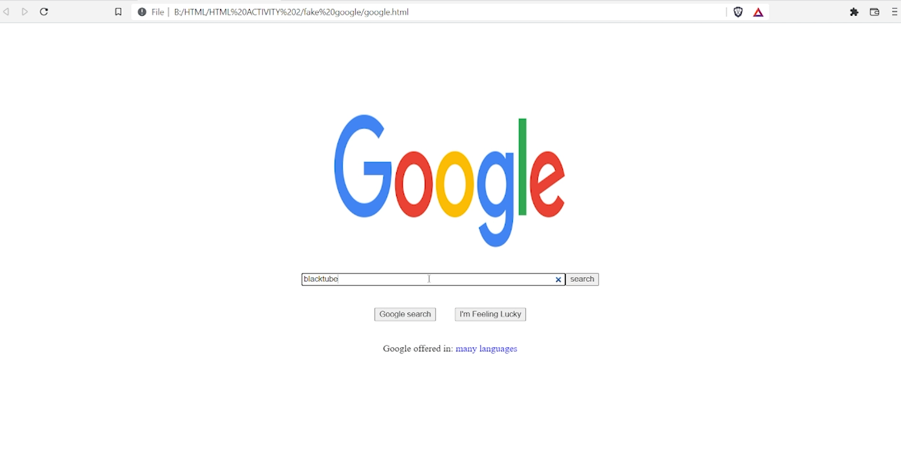
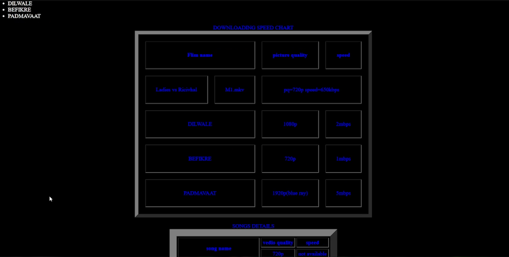
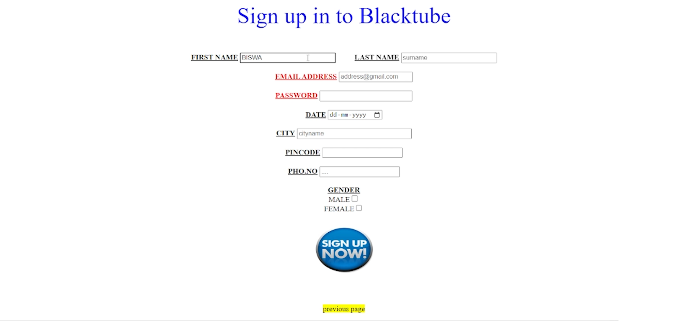
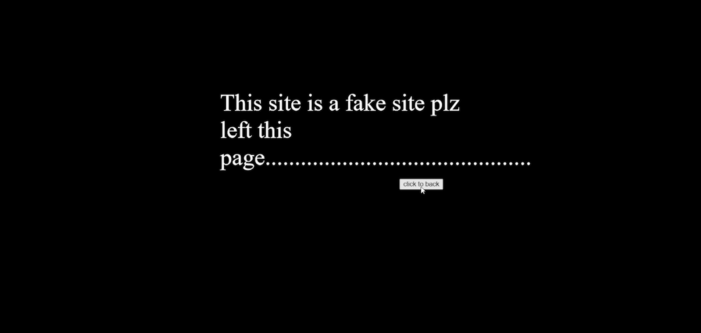

# Fake Google :star_struck: :family: :man: :woman: :sunny:

[](https://shields.io/) 

***This new WebSite named 'FAKE GOOGLE' is created by Biswarup Bhattacharjee, student of BTECH, in University of Engineering and Management, Kolkata.***

**Email Id: bbiswa471@gmail.com.** 

**Contact No: 916290272740.** 

<p align="left">
<a href="https://www.facebook.com/profile.php?id=100070395300810" target="blank"></a>
<a href="https://instagram.com/biswarup2210" target="blank"></a>
<a href="https://github.com/biswa2210/biswa2210" target="blank"></a>
</p>

## About :point_down: 

This is a basic website anmed Fake Google. It is created using HTML only. I created it for practicing HTML tags. Here are many interesting things.

## FAKE GOOGLE DEMO VIDEO: :point_right: <a href="https://www.youtube.com/watch?v=EOoiCryP1Wc&list=PL0lbDlMJ1h4hASHfEE-4cMS7CHRgtoxH5&index=9">Click here to watch</a>

## WEB DEV PLAYLIST: :point_right: <a href="https://www.youtube.com/watch?v=8_QAOpUdaIY&list=PL0lbDlMJ1h4hASHfEE-4cMS7CHRgtoxH5">Click here to watch</a>

## Folder Structure :point_down:

```bash
FAKE GOOGLE
     ├── error.html
     ├── google.html
     ├── sign.html
     └── youtube.html
 ```               
<div align="center">

<a href="fake1.png"></a> 
    
<a href="fake2.png"></a> 

<a href="fake3.png"></a> 

<a href="fake4.png"></a> 

<a href="fake5.png"></a> 

<a href="fake6.png"></a> 

</div>
